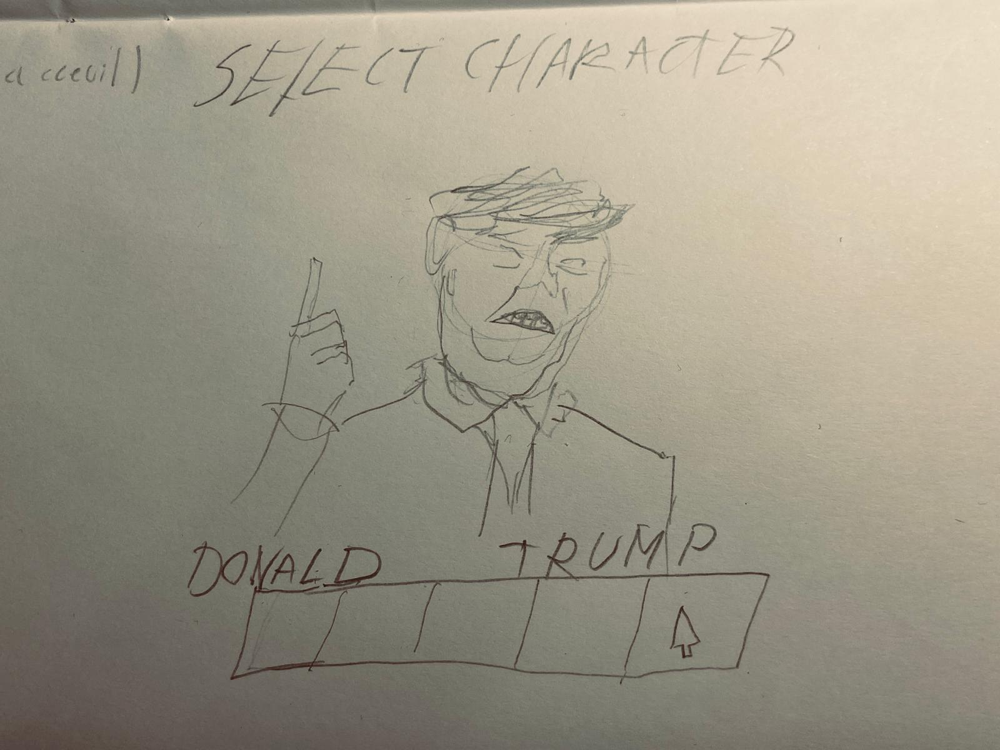
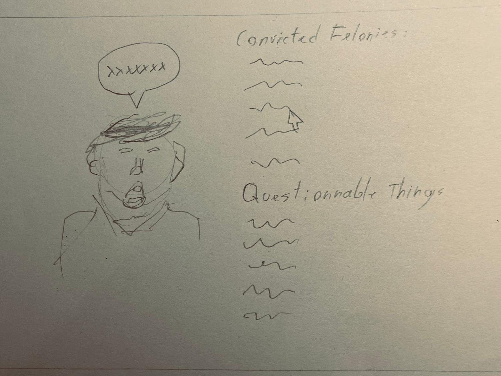

# modulemeb
## thème choisis
every crimes and questionnable things commited by the trump administration
## cahier des charges
Le site web sera structuré avec 1 première page où l'utilisateur pourra selectioner les différents ciminels de l'administration américaine comme un jeu de combat.

chaque autre pages étants dédiées à chaque personnages. Une liste des crimes sera affichés avec une deuxième partie pour les méfaits. Une version comique de la personne concernée sera présentée avec une citation, si possible en rapport avec le crime. Chaque crimes sera sourcé dans la bulle

Les personnalités couvertent seront :
* Donald Trump
* JD Vance
* Pete Hegseth
* Pam Bondi
* Robert F. Kennedy Jr.
## Le cahier des charge comprend des éléments imposés :

* Le site web doit contenir au minimum quatre pages dans quatre fichiers HTML différents, dont une page d’accueil.
* La page d’accueil doit présenter le sujet traiter et offrir au visiteur une table des matières du site web avec un lien vers les pages correspondantes et une brève description du contenu.
* Il doit y avoir une barre de navigation pour naviguer entre les quatre pages.
* Chaque page doit contenir au moins 100 mots.
* Le sujet traité doit être liés aux STIM et le contenu (texte, images, équations, code, animations, etc.) doit être cohérent, pertinent et maîtrisé par l’élève.
* La page web doit contenir soit des équations, soit du code informatique, soit un formulaire dynamique.
* Le site web doit être stylé avec une feuille CSS.
* Il doit y avoir une animation réalisée avec canvas. (Exemples)
* Le code doit être sur GitHub est être déployé sur le web avec GitHub Pages.
* La page doit pouvoir s’adapter aux petits écrans (smartphone).

## Maquette

